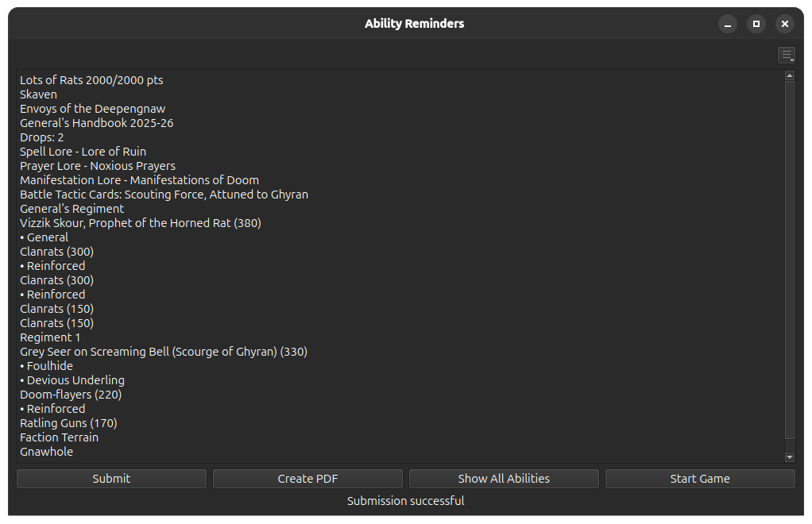
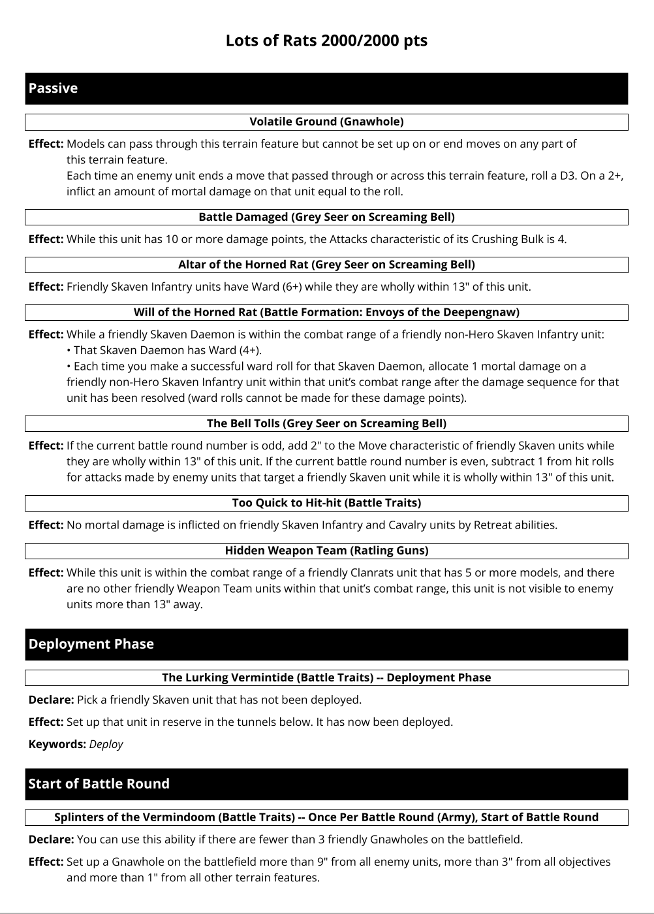
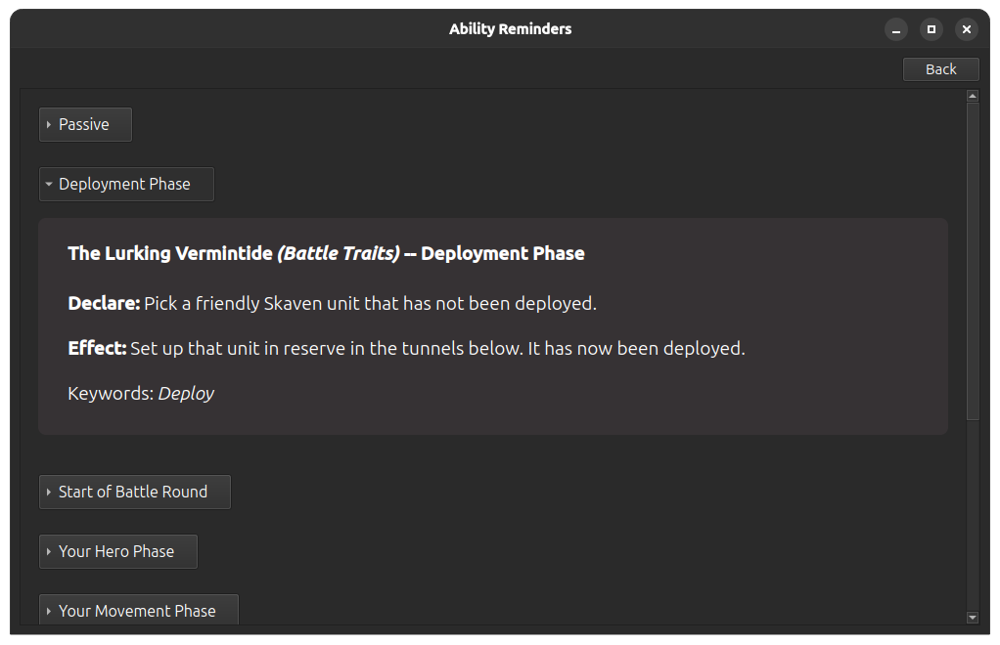
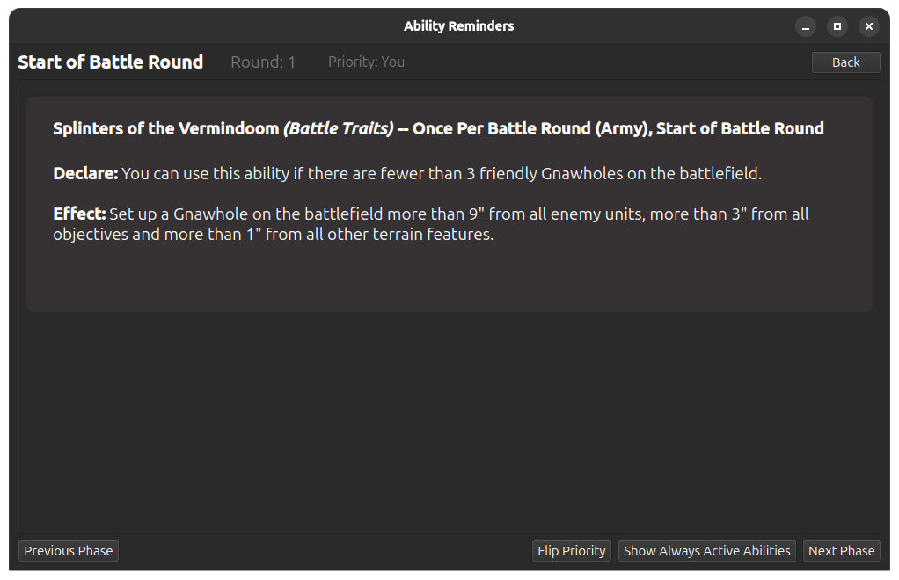

# Ability Reminders

**Ability Reminders** is a Python-based desktop application to help you remember all the abilities of your *Warhammer: Age of Sigmar* army — all dynamically powered by the data hosted on [BSData](https://github.com/BSData).

---

## Features

- **Automatic Data Updates:**  
  Downloads and updates faction data directly from the [BSData-AOS-4.0](https://github.com/BSData/age-of-sigmar-4th) repository when you submit an army list.


- **Multiple Output Modes:**  
  - Generate a formatted **PDF** with all relevant abilities sorted by phase.  
  - View and navigate abilities directly in the app. 
  - Use the **game mode** to click through phases during a game (Perfect when trying a new army in [Tabletop Simulator](https://store.steampowered.com/app/286160/Tabletop_Simulator/).


- **Planned for th future:**  
  - API for data access and custom integrations (No public hosting from me, I sadly do not have the capacity to do that).  

---

## Installation

You can download a packaged release in the releases section.

Alternatively you can clone the repository and run `main.py` it directly or package it yourself using your preferred Python packaging tool.

### Option 1: Download the Release (Recommended)
1. Visit the [Releases](../../releases) page.
2. Download the latest version for your operating system (Available for Windows and (Ubuntu) Linux).
3. Run the executable.

### Option 2: Run from Source
Make sure you have **Python 3.12** installed.

```
git clone https://github.com/TiWo778/ability-reminder.git
cd ability-reminder
pip install -r requirements.txt
python main.py
````

---

## Usage

* Open the app, paste in an army list and click the submit button to load your list. It should look something like this after. 
* You can at any time change where the data files get downloaded to and where your generated PDFs are stored via the Hamburger menu in the top right and also delete/refresh the currently installed data or download all available data. The default is `%APPDATA%\AbilityReminders\` on Windows and `~/.ability-reminders/` on Linux and Mac. <br><p align="center"></p>
* After loading a list, you can then choose one of the following by clicking the respective button:

   * **Create PDF:** Creates a PDF containing an ability summary. The file location is shown after PDF generation is completed. 
   * **Show All Abilities:** Shows all abilities sorted by phases in an Accordion Menu. 
   * **Start Game:** Enter interactive mode, where you can click through the phases of a game and are shown the abilities available to you in that phase. You can **Flip priority** when the current phase is *Start of Battle Round* to maintain proper order. You can click the **Show Always Active Abilities** button to open another window showing *Passive* and *Reaction* abilities. 

> I recommend using the format generated by the official *Age of Sigmar* app or [Sigdex](https://sigdex.io/) for your lists, as those are the only ones I tested. However, most list builders construct something similar so you are free to try out your favorite one and see if it works.

---

## How It Works

* **BSData Parsing:** Downloads and processes `.cat` files into structured Python `Faction`/`Unit`/`Weapon`/`Ability` objects based on a given faction name.
* **List Parsing:** Takes an army list in the format generated by the official *Age of Sigmar* app and parses it into a structured Python `List` object using the relevant `Faction` object.
* **Sorting Abilities:** Takes a list object and sorts the Abilities granted by Units/Battle Traits/Battle Formations etc. into a dict based on their timing.
* **PDF Generation:** Takes a dict of Abilities sorted by timing and generates a structured PDF file using [fpdf2](https://pypi.org/project/fpdf2)
* **UI:** Provides a clean interface created with [PyQt6](https://pypi.org/project/PyQt6/) for submitting lists and navigating abilities/generate PDFs.

If you’re a developer interested in exploring or extending the logic, check out the `core/`, `data_loading/` and `classes/` folders.

---

## Feedback & Issues

Found a bug? Got a feature request?
Feel free to [open an issue](../../issues)

---
